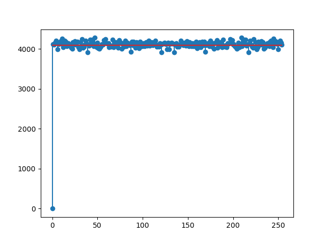
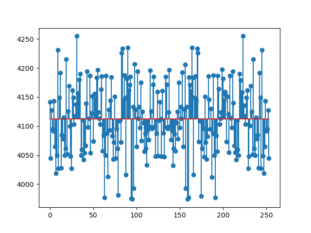
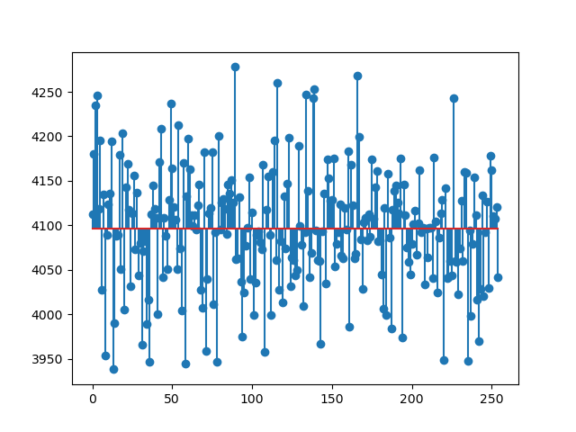

# Übungsblatt 1, Aufgabe 2

## Schlüsselstärke

Schlüsselstärke eines Rotors ist `256!` oder etwa 1683 bit (`log(factorial(256), 2)`). Werden merhere Rotoren kombiniert, wird die Schlüsselstärke der Rotoren addiert. Mit 3 Rotoren kommen wir also auch eine Schlüsselstärke von ~5051 bit. Der Schlüsselraum ist quasi unantastbar groß. Ein Brute Force Angriff ist praktisch unmöglich.

Es ist allerdings zu beachten, dass der Schlüsselraum sich nur bei ausreichender Länge des Eingabetextes entfalten kann. Ist der Eingabetext kürzer als 256 byte, so wird nur der erste Rotor verwendet. Die Eingabe entspricht also praktisch einem Schlüsselraum von nur einem Rotor.

## Schwächen

Das Eingabebyte kann nie auch das Ausgabebyte sein. In diesem Bias-Plot für 1 Mib Nullen ist dies auch schön zu sehen:

Sidechannel-Angriff: Es werden (wenn auch nur minimal) mehr Operationen ausgeführt, wenn ein Rotor rotiert wird. Möglicherweise ist dadurch die position der 0 auf dem Rotor feststellbar.

## Bias

In diesem Bias-Plot für 1 Mib Nullen (ausgeschlossen der 0) ist kein Bias zu erkennen:

Für 1 Mib and random Input sieht der Graph ähnlich aus.

## Indistinguishability

Da das Eingabebyte nie auf sich selbst abgebildet wird, kann Ciphertext von Random text unterschieden werden. (siehe Plot oben)
